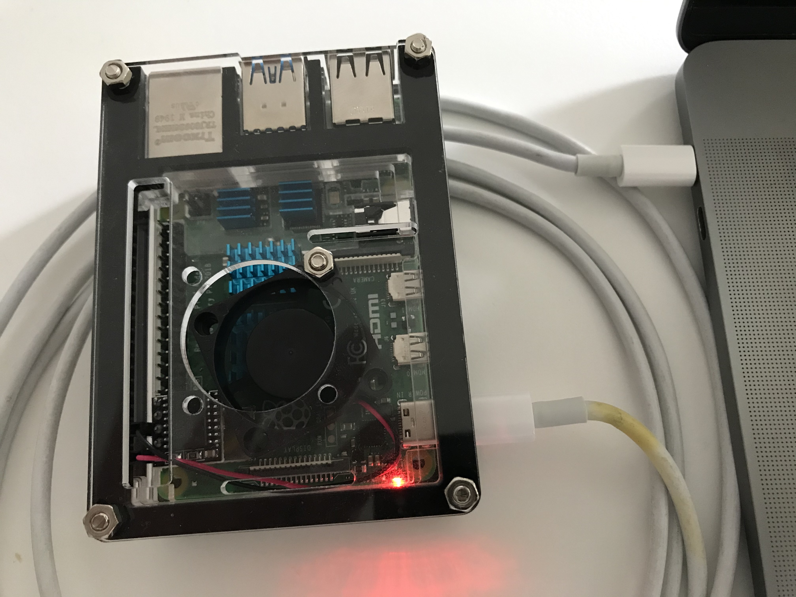
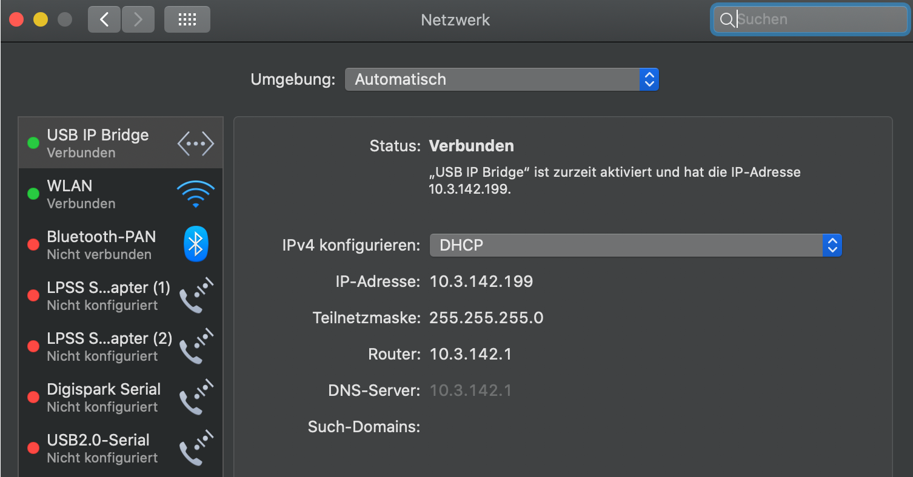

# usbip

shell script for setup IP protocol running over USB port on rpi platform 4

functions:

- start
- stop
- setup
- version

will use [https://www.kernel.org/doc/html/v4.17/driver-api/usb/gadget.html](Linux USB Gadget API)

for full installation and setup sequence, pls. see **installation and setup** section at the bottom of this file

rpi4 (8GB revision 1.2) connected to MacBook Pro via USB-C - USB-C cable\
pls. note: if you want to use USB-C connectors on both side, you need **rpi4 revision 1.2**\

on rpi
~~~bash
root@pump:/home/pi# ip a
1: lo: <LOOPBACK,UP,LOWER_UP> mtu 65536 qdisc noqueue state UNKNOWN group default qlen 1000
    link/loopback 00:00:00:00:00:00 brd 00:00:00:00:00:00
    inet 127.0.0.1/8 scope host lo
       valid_lft forever preferred_lft forever
    inet6 ::1/128 scope host 
       valid_lft forever preferred_lft forever
2: eth0: <NO-CARRIER,BROADCAST,MULTICAST,UP> mtu 1500 qdisc mq state DOWN group default qlen 1000
    link/ether dc:a6:32:b6:0b:c3 brd ff:ff:ff:ff:ff:ff
3: wlan0: <BROADCAST,MULTICAST,UP,LOWER_UP> mtu 1500 qdisc pfifo_fast state UP group default qlen 1000
    link/ether dc:a6:32:b6:0b:c4 brd ff:ff:ff:ff:ff:ff
    inet 10.8.81.130/24 brd 10.8.81.255 scope global dynamic noprefixroute wlan0
       valid_lft 863966sec preferred_lft 755966sec
    inet6 2a02:810d:1380:225c:bfed:3986:79d6:7624/64 scope global dynamic mngtmpaddr noprefixroute 
       valid_lft 4317sec preferred_lft 1617sec
    inet6 fe80::7fa7:7633:df8d:f0eb/64 scope link 
       valid_lft forever preferred_lft forever
4: usb0: <BROADCAST,MULTICAST,UP,LOWER_UP> mtu 1500 qdisc pfifo_fast state UP group default qlen 1000
    link/ether 6a:b1:3c:51:47:70 brd ff:ff:ff:ff:ff:ff
    inet 10.3.142.1/24 brd 10.3.142.255 scope global usb0
       valid_lft forever preferred_lft forever
    inet6 fe80::68b1:3cff:fe51:4770/64 scope link tentative 
       valid_lft forever preferred_lft forever
~~~

on MacBook
~~~bash
xxx@xxx-MBP-II ~ % ifconfig
en9: flags=8863<UP,BROADCAST,SMART,RUNNING,SIMPLEX,MULTICAST> mtu 1500
	options=6407<RXCSUM,TXCSUM,VLAN_MTU,CHANNEL_IO,PARTIAL_CSUM,ZEROINVERT_CSUM>
	ether 3e:92:e6:3b:75:5b 
	inet6 fe80::1cd5:7a5d:49bd:95ad%en9 prefixlen 64 secured scopeid 0x10 
	inet 10.3.142.199 netmask 0xffffff00 broadcast 10.3.142.255
	nd6 options=201<PERFORMNUD,DAD>
	media: autoselect (100baseTX <full-duplex>)
	status: active
~~~

## installation

rpi login as root required

~~~bash
root:# cd /usr/local/sbin
root:# rm usbip                  # just remove old usbip script
root:# wget https://raw.githubusercontent.com/rudiratlos/usbip/master/usbip
root:# chmod +x usbip
~~~

## setup

will install all required packages (e.g. dnsmasq),\
setting parameters and create config files:

- /etc/network/interfaces.d/usb0
- /boot/cmdline.txt
- /boot/config.txt
- /etc/modules
- /lib/systemd/system/usbip.service
- /sys/kernel/config/usb_gadget/pi4

Existing files will be backed up with a date extension (YYYYMMDDhhmmss). 

~~~bash
usbip setup
~~~

## start

start usbip:

- enable service (will start at next boot)
- start service
- bring up USB interface
- assign fixed IP address to USB interface
- start dnsmasq service

~~~bash
usbip start
~~~

## stop

stop usbip functions:

- stop dnsmasq service
- bring down USB IP interface and flush IP address
- disable service (will not start at next boot)

~~~bash
usbip stop
~~~

## version

show usbip script version

~~~bash
usbip version
~~~

## installation and setup

rpi login as root required

~~~bash
root:# cd /usr/local/sbin
root:# rm usbip                            # just remove old script
root:# wget https://raw.githubusercontent.com/rudiratlos/usbip/master/usbip
root:# chmod +x usbip
root:# apt-get update
root:# apt-get upgrade                     # optional

root:# usbip setup
~~~
